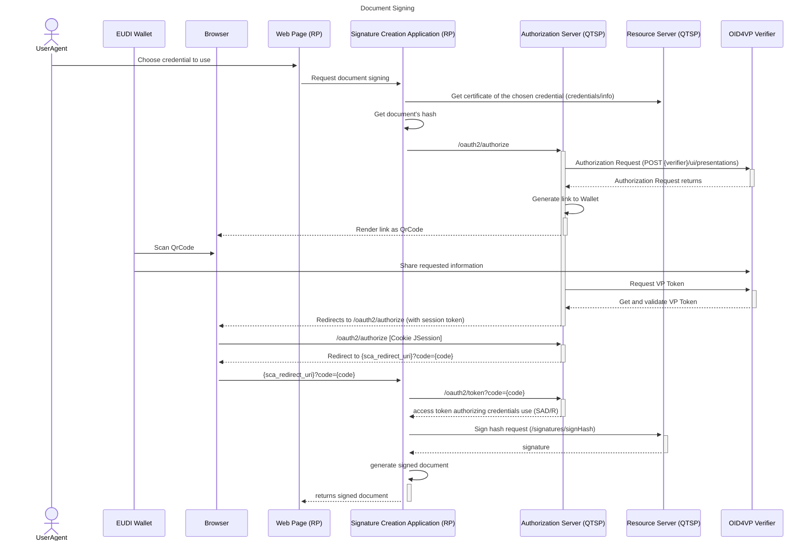

# EUDI RP-centric SCA

[](https://www.apache.org/licenses/LICENSE-2.0)

:heavy_exclamation_mark: **Important!** Before you proceed, please read
the [EUDI Wallet Reference Implementation project description](https://github.com/eu-digital-identity-wallet/.github/blob/main/profile/reference-implementation.md)

## Table of contents

- [EUDI RP-centric SCA](#eudi-rp-centric-sca)
  - [Table of contents](#table-of-contents)
  - [Overview](#overview)
  - [Disclaimer](#disclaimer)
  - [Sequence Diagrams](#sequence-diagrams)
    - [Credential Authorization](#credential-authorization)
  - [Endpoints](#endpoints)
    - [Calculate Hash Endpoint](#sign-document-endpoint)
    - [Obtain Signed Document Endpoint](#signature-callback-endpoint)
  - [Deployment](#deployment)
  - [Docker Deployment](#docker-deployment)
  - [How to contribute](#how-to-contribute)
  - [License](#license)
    - [Third-party component licenses](#third-party-component-licenses)
    - [License details](#license-details)


## Overview

This is a REST API server implementing the RP-centric SCA for the remote Qualified Electronic Signature (rQES) component of the EUDI Wallet.

This implementation of the SCA serves as a component of a Relying Party (RP) web page. It runs on the port 8088 and can be used to sign documents.
Currently, the server is running and being used by the RP web page at the url https://rpcentric.signer.eudiw.dev/tester. However, you can also [deploy](#deployment) it in your environment.

The RP web page utilizing this SCA, which is defined in the repository [eudi-srv-web-rpcentric-signer-relyingparty-py](https://github.com/eu-digital-identity-wallet/eudi-srv-web-rpcentric-signer-relyingparty-py).
It communicates with a QTSP server, which is defined in the repository [eudi-srv-web-walletdriven-rpcentric-signer-qtsp-java](https://github.com/eu-digital-identity-wallet/eudi-srv-web-walletdriven-rpcentric-signer-qtsp-java), to achieve the remote Qualified Electronic Signature (rQES) functionality, as described in the relevant specifications

## Disclaimer

The released software is an initial development release version:

-   The initial development release is an early endeavor reflecting the efforts of a short timeboxed
    period, and by no means can be considered as the final product.
-   The initial development release may be changed substantially over time, might introduce new
    features but also may change or remove existing ones, potentially breaking compatibility with your
    existing code.
-   The initial development release is limited in functional scope.
-   The initial development release may contain errors or design flaws and other problems that could
    cause system or other failures and data loss.
-   The initial development release has reduced security, privacy, availability, and reliability
    standards relative to future releases. This could make the software slower, less reliable, or more
    vulnerable to attacks than mature software.
-   The initial development release is not yet comprehensively documented.
-   Users of the software must perform sufficient engineering and additional testing in order to
    properly evaluate their application and determine whether any of the open-sourced components is
    suitable for use in that application.
-   We strongly recommend not putting this version of the software into production use.
-   Only the latest version of the software will be supported

## Sequence Diagrams

### Credential Authorization



## Endpoints

### Sign Document Endpoint

* Method: POST
* URL: http://localhost:8088/signatures/doc

This endpoint initiates the process to obtain a signed document. 

The request header must include:
* **Authorization**: a valid access token from the QTSP, with the scope 'service'

The payload of the request is a JSON object containing the following attributes:
* **credentialID**: the ID of the credential to be used to signing the document.
* **documents**: a JSON array of objects, where each object includes a base64-encoded document content to be signed and additional request parameters.
* **hashAlgorithmOID**: the OID of the hash algorithm used to generate the document's digest value.
* **authorizationServerUrl** (optional): The URL of a custom Authorization Server, if the user wishes to use one other than the default.
* **resourceServerUrl** (optional): The URL of a custom Resource Server, if the user wishes to use one other than the default.
* **redirectUri**: The URL to which the browser should be redirected after obtaining the signed document. The signed document will be sent to this URL.

If the request is successful, the browser will be redirected to the OAuth 2.0 Authentication Page.

### Signature Callback Endpoint

* Method: GET
* URL: http://localhost:8088/signatures/callback

This endpoint serves as the redirect endpoint, where the browser is redirected after the OAuth 2.0 Authorization process.

This endpoint must be called with the following query parameters, as defined in the OAuth 2.0 specification:
* **code**: The authorization code returned by the OAuth 2.0 Authorization Server.
* **state**: A value used to maintain state between the request and callback.

This endpoint displays an HTML page that allows the user to return to the RP page along with the signed document.

## Deployment

### Prerequisites

- Java 17
- Apache Maven 3.6.3

### Configure the OAuth2 Parameters

In the file **aplication.yml** in the **src/main/resources** folder, you can see the structure with the following data:

```
oauth-client:
    client-id: ${OAUTH2_CLIENT_ID}
    client-secret: ${OAUTH2_CLIENT_SECRET}
    redirect-uri: ${OAUTH2_REDIRECT_URI}
    scope: "credential"
    authorization-grant-types: ${OAUTH2_AUTHORIZATION_GRANT_TYPE}
    authorization-server-url: ${OAUTH2_AUTHORIZATION_SERVER_URL}
    resource-server-url: ${OAUTH2_RESOURCE_SERVER_URL}
```

From the previous parameters, you should define the environment variables "OAUTH2_CLIENT_ID", "OAUTH2_CLIENT_SECRET", "OAUTH2_REDIRECT_URI", "OAUTH2_AUTHORIZATION_GRANT_TYPE", "OAUTH2_AUTHORIZATION_SERVER_URL" and "OAUTH2_RESOURCE_SERVER_URL".
You can configure this in two different ways:

**Option A: Use environment variables**

Added the previous mentioned environment variables to the **.env** file at the root of the project, in a format:
```
OAUTH2_CLIENT_ID= ...
OAUTH2_CLIENT_SECRET= ...
OAUTH2_REDIRECT_URI= 'this_service_url' + /signatures/callback
OAUTH2_AUTHORIZATION_GRANT_TYPE= authorization_code
OAUTH2_AUTHORIZATION_SERVER_URL= ...
OAUTH2_RESOURCE_SERVER_URL= ...
```

To enable .env loading, ensure the following lines are **uncommented** in _application.yml_:

```
config:
    import: file:.env[.properties]
```

**Option B: Edit the application.yml directly**

Modify the value of the following parameters in the file at _src/main/resources/application.yml_:

```
oauth-client:
  client-id: ...
  client-secret: ...
  redirect-uri: 'this_service_url' + /signatures/callback
  scope: "credential"
  authorization-grant-types: ... Ex: authorization_code
  authorization-server-url: ...
  resource-server-url: ...
```

The data added to the previous parameter should be retrieved from one QTSP with support for OAuth2, and that makes available the endpoints:
* credentials/info
* signatures/signHash
* oauth2/authorize
* oauth2/token
As defined in the CSC API Specification v2.0.2.
### Configure the Timestamp Authority

For certain conformance levels, integration with a Timestamp Authority (TSA) is required.
You can configure the TSA in two ways:

**Option A: Use environment variables**

Define the environment variables:

- _TIMESTAMP_AUTHORITY_CERTIFICATE_FILEPATH_: Filepath to the TSA certificate
- _TIMESTAMP_AUTHORITY_URL_: TSA endpoint URL
- _TIMESTAMP_AUTHORITY_SUPPORTED_DIGEST_ALGS_: # List of the digest algorithms supported by the TSA

These can be added to a **.env** file at the root of the project. To enable .env loading, ensure the following lines are **uncommented** in _application.yml_:

```
config:
    import: file:.env[.properties]
```

**Option B: Edit the application.yml directly**

Modify the value of the following parameters in the file at _src/main/resources/application.yml_:

```
timestamp-authority:
    certificate-path: # Filepath to the TSA certificate
    server-url: # TSA server URL
    supported-digest-algorithm:# List of supported digest algorithms TSA.
        - "2.16.840.1.101.3.4.2.1" # Example
```
### Run the Signature Creation Application (SCA)

After configuring the above, navigate to the **tools** directory and run the script:

```
./deploy_sca.sh
```

## Docker Deployment

You can also deploy the Wallet-Driven External SCA using Docker, either by:

- Pulling the GitHub package image
- Building the image locally

### Prerequisites

- Docker

### Configure the OAuth2 Parameters

From the previous parameters, you should define the environment variables "OAUTH2_CLIENT_ID", "OAUTH2_CLIENT_SECRET", "OAUTH2_REDIRECT_URI", "OAUTH2_AUTHORIZATION_GRANT_TYPE", "OAUTH2_AUTHORIZATION_SERVER_URL" and "OAUTH2_RESOURCE_SERVER_URL".
You can configure this in two different ways:

**Option A: Use environment variables**

Added the environment variables "OAUTH2_CLIENT_ID", "OAUTH2_CLIENT_SECRET", "OAUTH2_REDIRECT_URI", "OAUTH2_AUTHORIZATION_GRANT_TYPE", "OAUTH2_AUTHORIZATION_SERVER_URL" and "OAUTH2_RESOURCE_SERVER_URL" to the **.env** file at the root of the project, in a format:
```
OAUTH2_CLIENT_ID= ...
OAUTH2_CLIENT_SECRET= ...
OAUTH2_REDIRECT_URI= 'this_service_url' + /signatures/callback
OAUTH2_AUTHORIZATION_GRANT_TYPE= authorization_code
OAUTH2_AUTHORIZATION_SERVER_URL= ...
OAUTH2_RESOURCE_SERVER_URL= ...
```

The data added to the previous parameter should be retrieved from one QTSP with support for OAuth2, and that makes available the endpoints:
* credentials/info
* signatures/signHash
* oauth2/authorize
* oauth2/token
As defined in the CSC API Specification v2.0.2.

### Configure the Timestamp Authority

To generate valid signed documents, the following TSA-related environment variables must be defined:

- _TIMESTAMP_AUTHORITY_CERTIFICATE_FILEPATH_: Filepath to the TSA certificate
- _TIMESTAMP_AUTHORITY_URL_: TSA endpoint URL
- _TIMESTAMP_AUTHORITY_SUPPORTED_DIGEST_ALGS_: # List of the digest algorithms supported by the TSA

These environment variables will need to be set up in a **.env** file presented next.

### Set Up Environment Variables

Create a **.env** file at the project root with the structure:

```
SPRING_PROFILES_ACTIVE=docker
TIMESTAMP_AUTHORITY_CERTIFICATE_FILEPATH=# Filepath to the TSA certificate, ex: /certs/tsa.crt
TIMESTAMP_AUTHORITY_URL=# TSA URL, ex: https://tsa.example.com
TIMESTAMP_AUTHORITY_SUPPORTED_DIGEST_ALGS=# Supported Digest Algorithm, ex: 2.16.840.1.101.3.4.2.1,2.16.840.1.101.3.4.2.3
OAUTH2_CLIENT_ID= # OAuth2 Client Id agreed with the QTSP
OAUTH2_CLIENT_SECRET= # OAuth2 Client Secret agreed with the QTSP
OAUTH2_REDIRECT_URI= # OAuth2 Redirect URI in this service. Ex: 'this_service_url'+/signatures/callback
OAUTH2_AUTHORIZATION_GRANT_TYPE= authorization_code
OAUTH2_AUTHORIZATION_SERVER_URL= # QTSP Authorization Server URL
OAUTH2_RESOURCE_SERVER_URL= # QTSP Resource Server URL
```

Replace the placeholder values as needed.

### Update docker-compose.yml

To ensure the correct execution of the progress, you will need to update the _docker-compose.yml_ given.

To mount the TSA certificate inside the container, update the volumes section:

```
volumes:
    - {host_path_to_certificate}:{container_path_to_certificate}
```

Example:

```
volumes:
- ./path/to/local/certs/tsa.crt:/certs/tsa.crt
```

**Note**: Ensure the value of _TIMESTAMP_AUTHORITY_CERTIFICATE_FILEPATH_ matches the container path.

If you wish to use the pre-built image available on GitHub instead of building the image locally, modify the docker-compose.yml by replacing the build section with an image declaration like so:

```
services:
  rp_centric_sca:
    image: ghcr.io/eu-digital-identity-wallet/eudi-srv-web-rpcentric-signer-sca-java:latest
    container_name: rp_centric_sca
    ...
```

**Optional**: To avoid port conflicts, change the exposed port:

```
ports:
    - "8088:8088" # Change first 8088 if the port is already used
```

### Build and Run with Docker

From the project root, run:
`docker compose up --build`

## How to contribute

We welcome contributions to this project. To ensure that the process is smooth for everyone
involved, follow the guidelines found in [CONTRIBUTING.md](CONTRIBUTING.md).

## License

### Third-party component licenses

See [licenses.md](licenses.md) for details.

### License details

Copyright (c) 2024 European Commission

Licensed under the Apache License, Version 2.0 (the "License");
you may not use this file except in compliance with the License.
You may obtain a copy of the License at

    http://www.apache.org/licenses/LICENSE-2.0

Unless required by applicable law or agreed to in writing, software
distributed under the License is distributed on an "AS IS" BASIS,
WITHOUT WARRANTIES OR CONDITIONS OF ANY KIND, either express or implied.
See the License for the specific language governing permissions and
limitations under the License.
